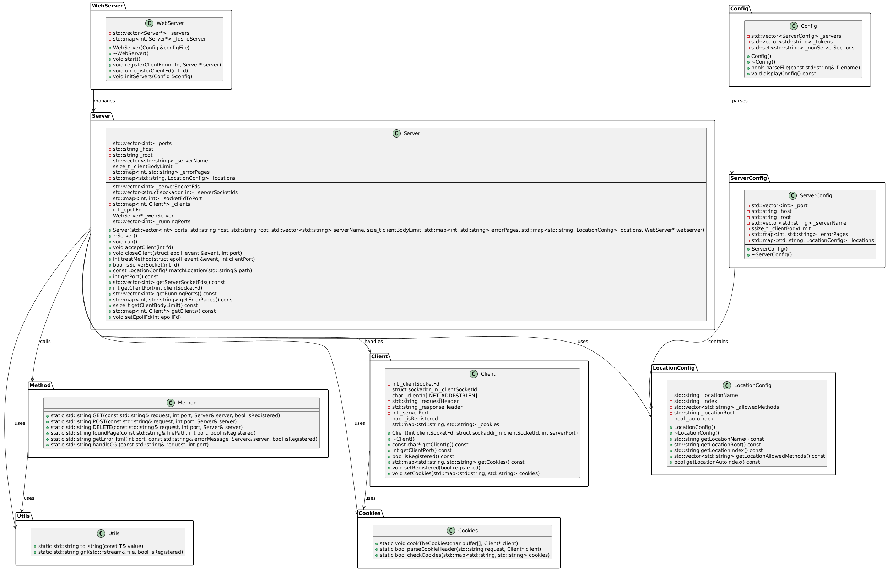

# WebServ Project

Welcome to **WebServ**, the web server project that probably won't crash... much. 🚀

This is a lightweight, blazing-fast, and slightly over-engineered web server built to make your life easier (or harder, depending on how you look at it). Perfect for serving your static files, dynamic content, or just impressing your peer because it's full of line of code.

## Project Overview

- **Language**: C++ (because ASSEMBLY wasn't allowed)
- **Features**: Handles HTTP requests, serves files, and occasionally surprises you with bugs.
- **Goal**: To learn, have fun, and maybe also because it a mandatory project.

## Architecture Diagram

Behold the masterpiece of engineering:

Very safe for you to use it instead of nginx! 😇
